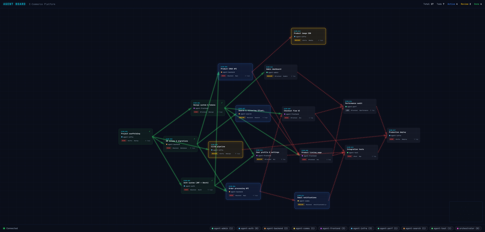

# Witch

멀티 에이전트 파이프라인을 실시간 DAG로 보여주는 MCP 서버.



## 왜 만들었나

에이전트가 태스크를 만들고 서로 의존하면서 일을 넘기는데, 시각화 없이는 JSON 찍어보면서 뭐가 어떻게 돌아가는지 추적해야 한다. Witch는 에이전트가 일하는 동안 카드, 엣지, 상태, 로그를 force-directed 그래프로 실시간 렌더링한다.

MCP 서버로 동작한다. 에이전트가 tool을 호출해서 카드를 만들고 상태를 바꾸면 대시보드가 WebSocket으로 받아서 바로 반영한다.

## 기술 스택

- MCP 서버: `@modelcontextprotocol/sdk`, WebSocket
- 대시보드: D3.js v7 force graph, 순수 SVG
- 저장: `~/.agent-kanban-board/` 경로에 JSON 파일

## 설치

```bash
cd kanban-mcp
npm install
npm run build
```

## Claude Code에서 사용하기

`.mcp.json`에 추가:

```json
{
  "mcpServers": {
    "kanban": {
      "command": "node",
      "args": ["kanban-mcp/dist/index.js"],
      "env": {
        "KANBAN_BOARDS_DIR": "~/.agent-kanban-board"
      }
    }
  }
}
```

대시보드 열기:

```bash
open http://localhost:3002
```

## MCP 도구 목록

| Tool | 설명 |
|------|------|
| `new_board` | 보드 생성 또는 전환 |
| `list_boards` | 저장된 보드 목록 |
| `get_board_info` | 보드 정보 + 대시보드 URL |
| `create_card` | 태스크 카드 생성 |
| `update_card_status` | 상태 변경 (의존성 제약 반영) |
| `assign_card` | 에이전트에 카드 할당 |
| `add_log` | 실행 로그 추가 |
| `add_dependency` / `remove_dependency` | 태스크 의존성 연결 |
| `archive_card` | 카드 아카이브 |
| `list_cards` / `get_my_cards` | 카드 조회 |

## 대시보드 기능

- 의존성 depth 기반 수평 배치의 force-directed DAG
- 상태별 글로우 이펙트: 작업 중이면 파란색, 리뷰 중이면 노란색, 완료면 초록색
- 카드 클릭하면 해당 카드의 의존성 트리 전체가 하이라이트됨 (upstream + downstream)
- 하단 에이전트 필터로 특정 에이전트 카드만 분리해서 볼 수 있음
- 큰 그래프용 미니맵
- 카드의 로그 카운트 클릭하면 실행 로그 모달
- WebSocket 기반 실시간 업데이트
